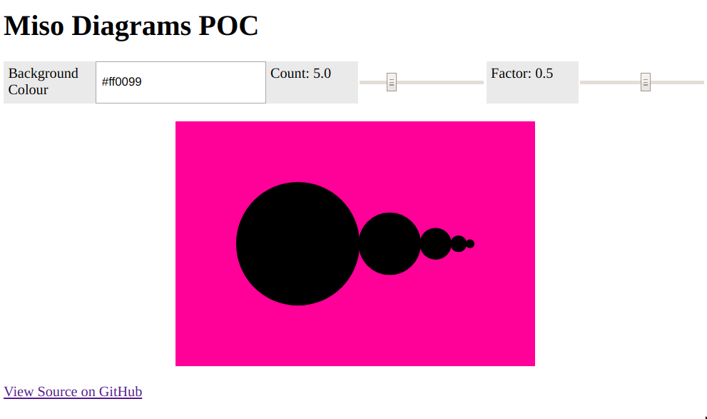

### About

Interactively render [diagrams](https://diagrams.github.io) in the JavaScript
by-way of [miso](http://github.com/dmjio/miso/) and
[diagrams-miso](https://github.com/cocreature/diagrams-miso) (and stack,
instead of nix).

```
11:18 AM noon ∈ diagrams-miso-poc (master*) ♫ stack --version
Version 1.9.3, Git revision 40cf7b37526b86d1676da82167ea8758a854953b (6211 commits) x86_64 hpack-0.31.1
```




### Requirements

- Stack
- `hsc2hs` available on your path.

I might've also required these things while building for the first time:

```
LD_PRELOAD=/usr/lib/x86_64-linux-gnu/libgtk3-nocsd.so.0

and

export PATH=/home/noon/.stack/programs/x86_64-linux/ghc-7.10.2/bin/:$PATH
```

Set up socket.io (for ghci usage):

```
npm install socket.io
export NODE_PATH=$(pwd)/node_modules
```

### View Online

[diagrams-miso-poc](https://silky.github.io/diagrams-miso-poc/frontend/dist/)


### Building

```
cd frontend
./build
```
